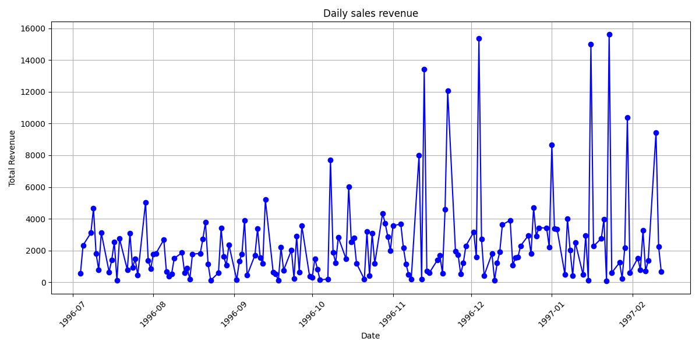

# 📊 Daily Sales Revenue DAG

This project is an **Apache Airflow DAG** that automates the process of extracting, transforming, and visualizing daily sales revenue from a PostgreSQL database.

---

## 🚀 Project Overview
The pipeline performs the following tasks:

- Fetch sales data (including product prices) from a PostgreSQL database.  
- Calculate total revenue per day using **pandas**.  
- Visualize daily revenue with **Matplotlib** and save the chart as a PNG image.  

---

## 🛠️ Tech Stack
- **Apache Airflow** → Workflow orchestration  
- **PostgreSQL** → Data source  
- **pandas** → Data processing  
- **matplotlib** → Visualization  

---

## 📂 Project Structure
```bash
daily-sales-revenue/
│── dags/
│   └── daily_sales_revenue.py   # Airflow DAG definition
│
│── data/
│   ├── daily_sales.csv          # Extracted raw sales data
│   └── daily_revenue.csv        # Processed daily revenue data
│
│── images/
│   └── daily_revenue.png        # Visualization output
│
│── requirements.txt             # Project dependencies
│── README.md                    # Project documentation
```
---
## ⚙️ Setup Instructions

Clone the repository:
```
git clone https://github.com/AhmedAtef1755/daily-sales-revenue.git
cd daily-sales-revenue
```

Install dependencies:
```
pip install -r requirements.txt

```

Place the DAG file inside your Airflow dags/ directory.
Configure the PostgreSQL connection in Airflow (postgres_conn).

Trigger the DAG manually or wait for the daily schedule.

---
## 📈 Example Output

The pipeline generates a chart like this:

